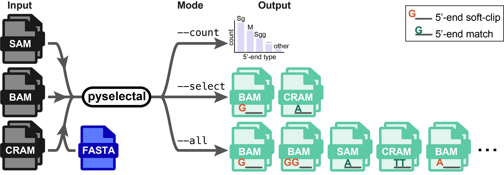
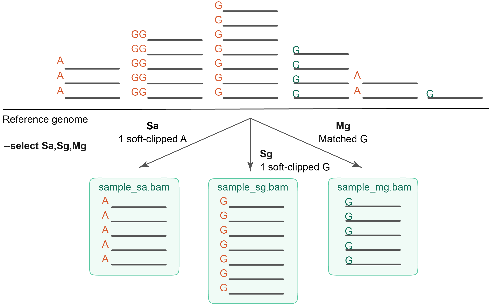

# pyselectal

Pyselectal (**Py**thon **select**ion of **al**ignments) is a Python script for filtering alignments in the BAM, SAM or [CRAM](https://samtools.github.io/hts-specs/CRAMv3.pdf) format by the length and sequence of the soft-clipped or matched 5′ end of single-end reads or forward reads of read pairs. You can select alignments matching a 5′-end pattern, profile the distribution of 5′-end types or split an alignment file per 5′-end type.



## Contents

- [Concept and motivation](#concept-and-motivation)
- [Requirements](#requirements)
- [Installation](#installation)
- [Usage](#usage)
- [Description](#description)
- [Options summary](#options-summary)
- [Options](#options)
- [Spec grammar](#spec-grammar)
- [Examples](#examples)
- [Resource usage](#resource-usage)
- [Testing](#testing)
- [Test data](#test-data)
- [Citation](#citation)

## Concept and motivation

Pyselectal is conceptually inspired by the alignment filtering strategy described in [Oguchi *et al.*, 2024](https://www.science.org/doi/10.1126/science.add8394), where transcription start sites (TSSs) were inferred from the precise 5′-end positions of 5′ single-cell RNA-seq reads. Specifically, Oguchi and colleagues distinguished transcription initiation from other events by the presence of the characteristic 5′ soft-clipped cap-dependent base `G` added by the reverse transcriptase during template switching.

Building on this approach, our tool enables general alignment filtering based on 5′-end soft-clipping or reference matching patterns, as well as optional 5′-end sequence constraints. While sequencing method-agnostic, `pyselectal` is particularly useful for CAGE ([Shiraki *et al.*, 2003](https://pubmed.ncbi.nlm.nih.gov/14663149/); [Murata *et al.*, 2014](https://pubmed.ncbi.nlm.nih.gov/24927836/)), nanoCAGE ([Salimullah *et al.*, 2011](https://pmc.ncbi.nlm.nih.gov/articles/PMC4181851/)), CAGEscan ([Bertin *et al.*, 2017](https://pubmed.ncbi.nlm.nih.gov/28972578/)) and other 5′-end-focused RNA sequencing experiments, both bulk and single-cell protocols, where precise control over the structure of the 5′-end alignment is critical for downstream analyses.

## Requirements

### Python

- **Python ≥ v3.8** is recommended ([for the best compatibility with modern *pysam*](https://pysam.readthedocs.io/en/latest/release.html)).
  - **Python ≥ v3.6** is required due to the use of [f-strings](https://peps.python.org/pep-0498/) in the `pyselectal` implementation.

### Python libraries

- **pysam ≥ 0.15.0**

`pysam 0.15.0` is the earliest version that supports the `threads` argument in `pysam.AlignmentFile` which is used for parallel BGZF compression / decompression. You can install `pysam` using `pip`:

```bash
pip install pysam
```

## Installation

Clone the repository and make `pyselectal.py` executable:

```bash
git clone https://github.com/nikitin-p/pyselectal.git
cd pyselectal
chmod +x pyselectal.py
```

Then, you can run it directly:

`pyselectal.py --help`

## Usage

Reading from `FILE`(s):

```bash
pyselectal.py -i FILE[,FILE,...] <mode> [optional arguments]
```

Reading from the standard input (`stdin`):

```bash
tool | pyselectal.py -i - <mode> [optional arguments]
```

## Description

`pyselectal` reads one or more BAM, SAM or [CRAM](https://samtools.github.io/hts-specs/CRAMv3.pdf) files with local alignments (that is, with possible soft-clipping). They can be obtained by running, for example, [STAR](https://github.com/alexdobin/STAR) with `--alignEndsType Local` or [HISAT2](https://github.com/DaehwanKimLab/hisat2) / [Bowtie2](https://github.com/BenLangmead/bowtie2) with `--local`. It requires setting exactly one `mode` of action:

1. `--select` to select alignments with particular properties of the 5′ end (a particular **5′-end type**).
2. `--count` to build the frequency distribution of all 5′-end types present in input files.
3. `--all` to split input files by the 5′-end type.

### Behaviour details

1. The 3′-end mapping pattern is ignored.
2. Unmapped reads are never selected.
3. For paired-end input, alignments must be name-sorted. `pyselectal` name-sorts internally by default; use `--no-name-sort` to skip if input is already name-sorted.
4. Multiple alignments of the same read (or read pair) are processed independently. Consider filtering for primary alignments beforehand (e.g., `samtools view -F 2304` to exclude secondary and supplementary alignments), unless studying multi-mappers.

## Options summary

```
-i, --input FILE[,FILE,...]   input file(s)
-s, --select SPEC[,SPEC,...]  select by 5′-end spec (see below)
-c, --count                   count 5′-end types
-a, --all                     split by 5′-end type
-o, --output PATH             output file or directory
-m, --merge                   merge specs into one output
-u, --unmatched [FILE]        write unmatched alignments (to custom FILE if set)
-x, --exclude                 invert selection
-p, --paired                  paired-end mode
-n, --no-name-sort            skip name sorting
-t, --threads N               number of BGZF threads
-S, --sam                     force SAM output
-B, --bam                     force BAM output
-C, --cram                    force CRAM output
-r, --reference FASTA         reference for CRAM
--matched-prefix N            number of matched bases in --count
--collapse-threshold PCT      collapse rare 5′-end types
-h, --help                    show help
-v, --version                 show version
```

## Options

Detailed descriptions of available options below are grouped by topic. See [Output](#output) for the specificiations of output files generated when using different options and option combinations.

### Input

`-i, --input FILE[,FILE,...]` — Comma-separated alignment file(s). The file format is auto-detected from the extension (`.bam`, `.sam` or `.cram`). Use `-` for reading from `stdin` (in this case, the input format is auto-detected by magic bytes ([SAM/BAM](https://samtools.github.io/hts-specs/SAMv1.pdf), [CRAM](https://samtools.github.io/hts-specs/CRAMv3.pdf))). At least one input file is required. The CRAM input format additionally requires providing a reference genome sequence in the FASTA format with `--reference`.

`-r, --reference FASTA` — Reference FASTA file for CRAM input (or output).

### Modes

Exactly one mode is required:

`-s, --select SPEC[,SPEC,...]` — Select alignments whose 5′ end matches one or more **5′-end specs** (see the [Spec grammar](#spec-grammar) below).



`-c, --count` — Create a frequency histogram of all 5′-end types present in input. It is written in a TSV format with columns `type` and `count`. Rows (5′-end types) are sorted by decreasing count.

`-a, --all` — Write each alignment to a respective 5′-end type-specific file.

### Selection modifiers

`-m, --merge` — With `--select` and multiple specs, write all matched alignments to one output file instead of one file per spec. If several input files are provided, then for each of them there will be one output file with all matched alignments.

`-u, --unmatched [FILE]` — Write alignments that do not match any spec to a separate auto-named file (or to a FILE if provided). Requires `--select`. Not affected by `--output`. Incompatible with `--exclude`.

`-x, --exclude` — Invert the `--select` logic: output every alignment that matches *none* of the given specs (analogous to `grep -v`). Requires `--select`. Incompatible with `--merge` and `--unmatched`.

### Processing

`-n, --no-name-sort` — Skip internal name sorting (use if input is already name-sorted). By default, `pyselectal` name-sorts input before processing.

`-t, --threads N` — BGZF compression / decompression threads (default: 1).

`-p, --paired` — Paired-end mode: selection is applied to forward-read alignments; alignments of reverse mates corresponding to selected forward mates are included automatically.

`--matched-prefix N` — Number of 5′ matched bases to show in the `--count` output (default: 5). If $N=0$, the fequencies of matched 5′ ends are calculated per matched length, irrespectively of the sequence. Requires `--count`.

`--collapse-threshold PCT` — Collapse 5′-end types strictly below PCT% of the total number of alignments into `other_soft_clipped` and `other_matched` rows of the frequency historgram (if `-c/--count` is set) or into respective automatically named output files (if `--all` is set) (default: 1). If $\mathrm{PCT}=0$, do not collapse any 5′-end types.

### Output

By default, output files are named automatically, based on the names and formats of input files. For `--select` and `--all`, the output format matches the input format; with multiple input files in different formats, each output inherits its corresponding input's format. In autogenerated output file names, `{stem}` refers to the input file name without its extension (e.g., the stem of `sample.bam` is `sample`), and `{ext}` refers to the output file extension (`bam`, `sam`, or `cram`).

`-o, --output PATH` — Output file path (for `--select` and `--count`) or directory (for `--all`). Overrides automatic naming. For `--select` with multiple specs, `-o` requires `--merge` or `--exclude` (otherwise each spec would overwrite the same file). For `--all`, the directory is created if it does not exist; for `--select` and `--count`, the parent directory must already exist.

`-S, --sam` / `-B, --bam` / `-C, --cram` — Force a single output format for all output files. `-C` requires `--reference` (see [Input](#input)). The output file extension is adjusted accordingly (e.g., forcing SAM output on `sample.bam` produces `{stem}_{spec}.sam`).

**Overwrite behaviour:** existing files are silently overwritten without warning or backup.

Output file naming depends on the mode and additional options:

- `--select`: `{stem}_{spec}.{ext}` per spec, per input file.
- `--select --unmatched`: Additionally writes `{stem}_unmatched.{ext}`.
- `--select --merge`: `{stem}_merged.{ext}` per input file.
- `--select --merge --unmatched`: Additionally writes `{stem}_unmatched.{ext}` per input file.
- `--select --exclude`: `{stem}_excluded.{ext}` per input file.
- `--count`: `{stem}_5prime_counts.tsv` per input file.
- `--all`: `{stem}_{type}.{ext}` per 5′-end type, per input file.
- `--all --collapse-threshold PCT`: Additionally writes `{stem}_other_soft_clipped.bam` / `{stem}_other_matched.bam`.

### General

`-h, --help` — Display a full manual and exit.

`-v, --version` — Print the program version and exit.

## Spec grammar

A spec describes a set of 5′-end types as `[n|n..|..m|n..m]<S|M>[pattern]`: 

| Part | Meaning |
| --- | --- |
| `S` | Soft-clipped 5′ end |
| `M` | Matched 5′ end |
| `n` (before `S` or `M`) | Exactly `n` bases |
| `n..m` | Between `n` and `m` bases (inclusive) |
| `n..` | At least `n` bases |
| `..m` | At most `m` bases |
| `pattern` | A pattern that *the whole* 5′-end sequence, governed by an `S` or `M` operation, should satisfy |

Specs are case-insensitive. Either operation `S` (soft-clip) or `M` (match) is required. Numbers `n` and `m` limit the length of 5′ ends that satisfy the operation and sequence pattern (if a pattern is set).

A `pattern` can be a literal sequence (`g`, `ttc`) or a [Python regular expression](https://docs.python.org/3/library/re.html#regular-expression-syntax) (regex; for example, `g+`, `g.c` or `[acgt]+`). The entire 5′-end sequence under a given operation must match the `pattern` (Python [`re.fullmatch()`](https://docs.python.org/3/library/re.html#re.fullmatch) semantics). Reverse-strand alignments are handled automatically: the sequence is reverse-complemented before matching.

If the `pattern` is a literal (no Python regex metacharacters), the required length of the 5′-end sequence is inferred from the `pattern` itself. For instance, `Sg` equals `1Sg` and `Sttc` equals `3Sttc`. When a `pattern` is a Python regex, an optional quantifier (see `n` and `m` above) controls the acceptable length of matches.

Spec examples:

| Spec | Set of matching 5′ ends |
| --- | --- |
| `S` | Any soft-clipped 5′ end |
| `M` | Any matched 5′ end |
| `2S` | Exactly 2 soft-clipped bases of any kind  |
| `3M` | Exactly 3 matched bases |
| `2..5S` | From 2–5 soft-clipped bases |
| `3..M` | At least 3 matched bases |
| `..4S` | Up to 4 soft-clipped bases (inclusive) |
| `Sg` | Exactly 1 soft-clipped `G` (equals `1Sg`) |
| `Ma` | Exactly 1 matched `A` (equals `1Ma`) |
| `Sttc` | Soft-clipped `TTC` (equals `3Sttc`) |
| `Maat` | Matched `AAT` (equals `3Maat`) |
| `2Ma` | Empty — pattern `a` is 1 base but matched 2 bases are required |
| `2..3Sa` | Empty — pattern `a` is 1 base but from 2–3 soft-clipped bases are required |
| `2..3Saa` | Equals `Saa` — the `2..3` quantifier is redundant with a literal pattern |
| `Sg+` | Soft-clipped `G`-homopolymer of length 1 or more |
| `..5Sg+` | Soft-clipped `G`-homopolymer of length from 1–5 |
| `Mac+t` | Matched 5′ end `ACT`, `ACCT`, `ACCCT`, ... |
| `..4Mac+t` | Only `ACT` or `ACCT` (the length of a match is required to be at most 4) |
| `Sg.c` | Soft-clipped `GAC`, `GGC`, `GCC` or `GTC` |
| `4Sg.c` | Empty — regex `g.c` matches length 3, but length 4 is required |
| `Sg[ga]c` | Soft-clipped `GGC` or `GAC` |
| `3..4Sca+g` | Soft-clipped `CAG` or `CAAG` |
| `4Sca+g` | Soft-clipped `CAAG` |

## Examples

1. Select single-end CAGE alignments with exactly 1 soft-clipped `G` at the 5′ end (cap-dependent `G`):

```bash
pyselectal.py -i in.bam --select Sg
# output: in_sg.bam
```

2. Select paired-end CAGEscan alignments where R1 has exactly 3 soft-clipped `G` at the 5′ end; include alignments of the corresponding R2 mates:

```bash
pyselectal.py -i in.bam --select Sggg --paired -o out.bam
```

3. Select single-end alignments with exactly 1 soft-clipped `A`, `C` or `T`, or with exactly 2 soft-clipped `G`, or with any matched 5′ end, and put the selected alignments in the respective output BAM files (one file per 5′-end type):

```bash
pyselectal.py -i in.bam --select Sa,Sc,St,Sgg,M
# output: in_sa.bam, in_sc.bam, in_st.bam, in_sgg.bam, in_m.bam
```

4. Select single-end alignments with exactly 1 soft-clipped `A` or `C` from two input files of different formats and put the selected alignments in the respective output files (one file per 5′-end type per input file):

```bash
pyselectal.py -i in1.bam,in2.cram -r ref.fa --select Sa,Sc
# output: in1_sa.bam, in1_sc.bam, in2_sa.cram, in2_sc.cram
```

5. Select single-end alignments with either one or two `G` bases soft-clipped at the 5′ end and write all selected alignments into one output file:

```bash
pyselectal.py -i in.bam --select Sg,Sgg --merge -o out.bam
```

6. Select single-end alignments with a matched 5′ end `GG`:

```bash
pyselectal.py -i in.bam --select Mgg
# output: in_mgg.bam
```

7. Select single-end alignments with at least 10 matched bases at the 5′ end, without a sequence constraint, and count these alignments:

```bash
pyselectal.py -i in.bam --select 10..M -o out.bam && samtools view -c out.bam
```

8. Select alignments with 1 soft-clipped `G` at the 5′ end and save unmatched alignments to a separate file:

```bash
pyselectal.py -i in.bam -s Sg -u
# output: in_sg.bam (matched alignments), in_unmatched.bam (unmatched alignments)
```

9. Same as above, but specify a custom file name for unmatched alignments:

```bash
pyselectal.py -i in.bam -s Sg -u rejected.bam
# output: in_sg.bam (matched alignments), rejected.bam (unmatched alignments)
```

10. Exclude single-end alignments with exactly 1 soft-clipped `G` at the 5′ end:

```bash
pyselectal.py -i in.bam -s Sg -x
# output: in_excluded.bam
```

11. Exclude all soft-clipped reads across multiple specs and write the result to a named file:

```bash
pyselectal.py -i in.bam -s Sg,Sgg,Sggg -x non_g.bam
# output: non_g.bam
```

12. Count all 5′-end types present in the input file and generate the corresponding TSV histogram. By default, types accounting for less than 1% of alignments are collapsed into a single "other" row:

```bash
pyselectal.py -i in.bam --count -o counts.tsv
```

13. Write each alignment to a separate file by its 5′-end type and place the output files into `out_dir/`. Types accounting for less than 1% of alignments are routed to `in_other_soft_clipped.bam` or `in_other_matched.bam`:

```bash
pyselectal.py -i in.bam --all -o out_dir/
```

14. As above, but 5′-end types accounting for less than 5% of alignments are written to `out_dir/in_other_soft_clipped.bam` or `out_dir/in_other_matched.bam`, instead of individual files:

```bash
pyselectal.py -i in.bam --all --collapse-threshold 5 -o out_dir/
```

15. Split multiple input files by 5′-end type into a shared output directory; each input file generates its own set of 5′-type-specific files (e.g., `sample1_1sg.bam`, `sample2_1sg.bam`):

```bash
pyselectal.py -i sample1.bam,sample2.bam --all -o out_dir/
```

16. Pipe a CRAM stream into `pyselectal` (convert BAM to CRAM, then filter):

```bash
samtools view -C -T ref.fa in.bam | pyselectal.py -i - --select Sg -r ref.fa -o out.cram
```

## Resource usage

Benchmarks on three SE BAM files with 5 million alignments each (Intel Xeon Processor Icelake, ~2 GHz):

| Mode | Time (avg) | Memory |
| --- | --- | --- |
| `--select` | ~37 s | ~950 MB |
| `--count` | ~43 s | ~950 MB |
| `--all` | ~68 s | ~950 MB |

Notes:

- `--select` is the fastest mode, processing ~135,000 alignments per second.
- `--count` is slightly slower due to per-alignment type classification.
- `--all` takes roughly twice as long because it performs two passes over the input (first to count types for `--collapse-threshold`, then to route alignments).
- Memory usage is stable regardless of mode and input size, since `pyselectal` processes alignments in a streaming fashion (paired-end mode buffers one read group at a time).
- Processing is **single-threaded** (~95–99% CPU utilization); the `-t/--threads` option only affects BGZF compression / decompression, not the main processing loop.

## Testing

The project uses [pytest](https://docs.pytest.org/) for automated testing. To run the full test suite:

```bash
python -m pytest test_pyselectal.py -v
```

All tests are contained in `test_pyselectal.py` and cover spec parsing, alignment matching, single-end / paired-end alignment processing and end-to-end execution.

## Test data

The repository includes small, synthetic BAM files under `testdata/` that are designed for **functional testing of `pyselectal`**.  
These files are intended for testing, debugging and illustrating tool behaviour, not for benchmarking or performance evaluation.

### `test_softclip_se.bam`

A test BAM file containing a curated set of single-end alignments with diverse 5′-end configurations:

- Alignments with **5′ soft-clips** of varying lengths (`1S`, `2S`, `3S`, `4S`).
- Alignments with **matched 5′-ends** and **soft-clipping at the 3′ end**.
- Alignments on both plus and minus strands.
- Homopolymer soft-clips (`G` or `C`) suitable for testing range-based selection.
- Multiple alignments per query to ensure that selection depends only on the CIGAR string structure and sequence content, not on mapping multiplicity.

### `test_softclip_pe.bam`

A test BAM file containing paired-end alignments grouped by query name and matching various conditions:

- R1 has a 5′ soft-clip.
- R1 has a matched 5′ end.
- R1 has multiple alternative alignments.
- R1 alignment is associated with more than one R2 alignment.

Test BAM files are small and can be inspected manually with:

```bash
samtools view testdata/test_softclip_se.bam
samtools view testdata/test_softclip_pe.bam
```

## Citation

If you use `pyselectal` in your research, please cite:

> Nikitin P., Sidorov S. pyselectal: Python selection of alignments by 5′-end type. 2026. https://github.com/nikitin-p/pyselectal

BibTeX:

```bibtex
@software{pyselectal,
  author       = {Nikitin, Pavel and Sidorov, Sviatoslav},
  title        = {pyselectal: Python selection of alignments by 5′-end type},
  year         = {2026},
  url          = {https://github.com/nikitin-p/pyselectal},
  note         = {Version 1.0}
}
```
